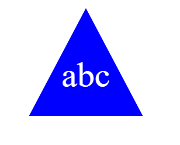

# SVG_Creator

## Description

An easy way to create a simple, yet effective, SVG logo!

All you have to do is choose your shape 🔼⏹️⏺️, colors 🔴🟡🟢🔵, and text 📝.

## Table of Contents

- [Installation](#installation)
- [Usage](#usage)
- [Credits](#credits)

## Installation

Node.js - Inquirer 8.2.4 & Jest 24.9.0 required

## Usage

Initialize prompts by using 'npm index.js"
Use the terminal to answer the questions.

When complete, "Generated logo.svg" will appear in the terminal. Navigate to your new file to see.

Open your SVG in the browser to view your beautiful new image!

Checkout this VSCode walkthrough video if you have any questions: [Walkthrough](https://drive.google.com/file/d/1DHUhLLihd-3W0lPR-psGuJ6Boj3Jz_uO/view)

## Credits

Special Thanks to the UCF Coding Bootcamp TA, Eric. 

Resources:

[MaxLength-Prompt](https://github.com/jwarby/inquirer-maxlength-input-prompt)

[Basic SVG shapes](https://developer.mozilla.org/en-US/docs/Web/SVG/Tutorial/Basic_Shapes)

